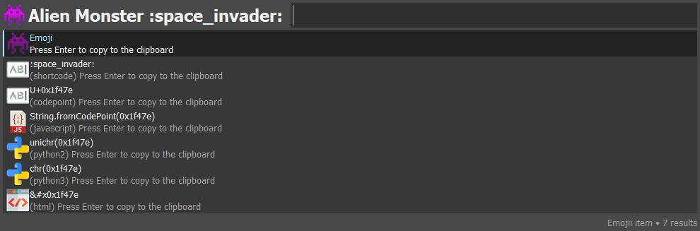

# Keypirinha Plugin: Emojii

This is **Emojii**, a plugin for the
[Keypirinha](http://keypirinha.com) launcher.

Search for emojis and copy them or theirs respective codes in various programming languages.

# Screenshots

### Search for emoji:

### Copy what you want:

# Installation

### With [PackageControl](https://github.com/ueffel/Keypirinha-PackageControl)

Install Package "keypirinha-emojii"

### Manually

* Download the `Emojii.keypirinha-package` from the [releases](https://github.com/andriykrefer/keypirinha-emojii/releases/latest).
* Copy the file into `%APPDATA%\Keypirinha\InstalledPackages` (installed mode) or
  `<Keypirinha_Home>\portable\Profile\InstalledPackages` (portable mode)

# Usage

Open Keypirinha and find the catalog item `Emojii: Search`. Usually typing `emo:` is enough. The rest is self-explanatory.

# License

This package includes pyperclip, witch uses BSD license. Apart from that, do whatever you want to do with this package.
